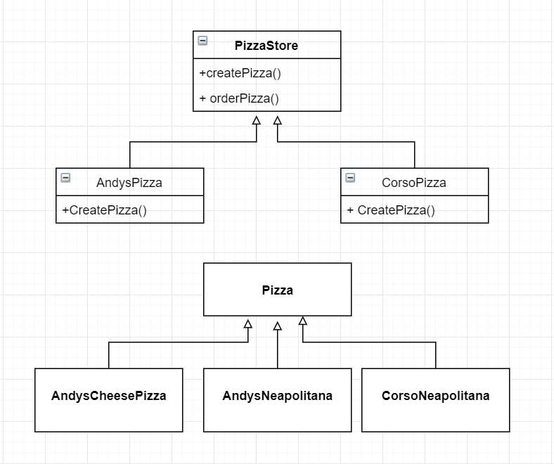

# Laboratory Work nr.1
## Task 
Create a program/app that implements all 5 creational design patterns
## Creational patterns
1. _Abstract Factory_
2. _Factory Method_
3. _Singleton_
4. _Prototype_
5. _Builder_

## Solution 
In my project I have several classes:
1. _Franchise_  - it uses singleton design pattern and provide us with a pizzaNetwork instance
2. _PizzaNetwork_ - create Andy's pizza store and Corso pizza store
3. _PizzaStore_ and _Pizza_ - use Factory Method Pattern
4. _Pizza_ are made using the Builder Design Pattern
5. _IngredientsFactory_ uses Abstract Factory Design Pattern 

In order to explain how it works, I am going to show it using several diagrams:
Factory Design Pattern:

