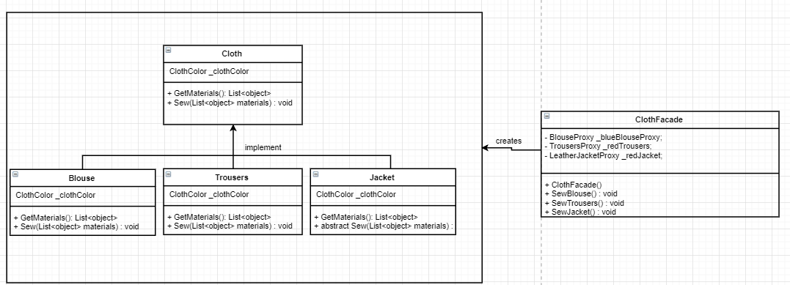
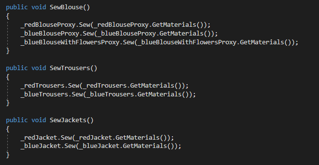

# Laboratory Work nr.2
## Task 
Create a program/app that implements all 5 structural design patterns
## Choosed design patterns
1. _Facade_
2. _Bridge_
3. _Composite_
4. _Decorator_
5. _Proxy_

## Solution 
In my project I have several classes:
1. _ClothesFacade_  - that implements facade design patterns
2. _ColoredClothes_ - implements brdige design pattern
3. _ClothDecorator_ - uses Decorator Pattern
4. _Employee_ -  implments Composite design pattern
5. _BlouseProxy_, _TrousersProxy_, _JacketProxy_  - use Proxy Design Pattern 

## General idea
We have a Clothing Factory that have employees who sew different articles of clothing: blouses, trousers and leather jackets of 
different color.

*__Facade Design Pattern__* - is one of the simpler patterns and the more useful. It hides complexity which cannot be refactored away and 
 and provides an interface to the client using which the client can access the system.  
 In my work  I use this pattern as is represented in the diagram below: 
 
 So we have  a clothFacade that is responsible for sewing different items of different colors and as a client we only declare a ClothFacade and
 call the corresponding method, for example: 
 ```c#
  ClothesFacade clothesFacade = new ClothesFacade();
            switch (_departmentName)
            {
                case Departments.Blouse:
                {
                    clothesFacade.SewBlouse();
                    break;
                }
                case Departments.Jacket:
                {
                    clothesFacade.SewJackets();
                    break;
                }
                case Departments.Trousers:
                {
                    clothesFacade.SewTrousers();
                    break;
                }
            }
```
Facade code is responsible for calling  the corresponding methods:
 


